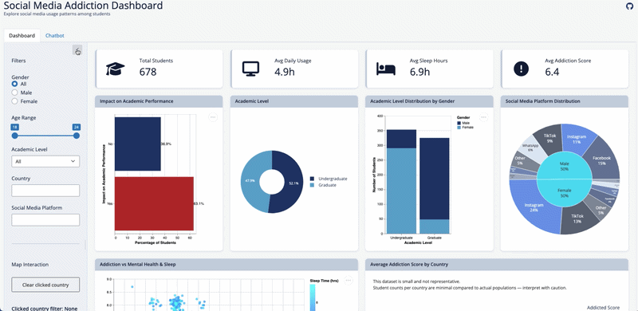

# Social Media Addiction Analytics Dashboard

### Project Summary & Motivation

This project presents an interactive data visualization dashboard designed to explore patterns in social media usage and addiction among students. The dashboard allows users to explore the correlation between daily usage hours, sleep duration, mental health scores, academic performance, and preferred platforms.

The dashboard is intended for school administrators, counselors, and students seeking to better understand digital behavior and its impact on well-being and academic outcomes. Through interactive filtering and comparative visualizations, users can potentially identify high-risk groups and conduct targeted interventions or self regulation making based on this.

### Demo



### Setup (for contributors)
First, clone the repository and navigate into the project directory:

```bash
git clone git@github.com:UBC-MDS/DSCI-532_2026_30_social-media-addiction.git
cd DSCI-532_2026_30_social-media-addiction/
```

Then install the development environment:

```bash
conda env create -f environment.yml
conda activate 532-social-media-addiction
```

Run the below command to download the dataset:

```bash
python src/download_data.py
```
To run the shiny app locally, navigate to the project root directory and run shiny with the following command:
```bash
shiny run src/app.py
```
You will be able to access the app at the link displayed in the command line.

### Live App

#### Stable (main): 
https://019ca108-2c5a-f4a9-1093-cdd4a540d77d.share.connect.posit.cloud/

#### Preview (dev): 
https://019ca127-fdc0-0c6d-1031-e1462c7abb05.share.connect.posit.cloud/

## Running Tests

This project includes both:

- **Unit tests** for core dashboard logic in `src/logic.py`
- **Playwright end-to-end tests** for key dashboard interactions in the running Shiny app

All tests can be executed with a single command.

---

## Activate the project environment if not yet activated

```bash
conda activate 532-social-media-addiction
```

## Install testing dependencies

If the testing libraries are not already installed, run:

```bash
python -m pip install pytest pytest-playwright playwright
```

## Install Playwright browser binaries

Playwright requires browser binaries. Install them once per environment:
```bash
python -m playwright install
```

Run all tests (single command)

From the project root directory, run:

```bash
PYTHONPATH=. shiny run src/app.py
```

```bash
PYTHONPATH=. pytest -q
```
This command runs both:

- unit tests (tests/test_logic.py)
- Playwright UI tests (tests/test_dashboard_playwright.py)


## Optional: Run specific test groups
Run only unit tests
```bash
PYTHONPATH=. pytest tests/test_logic.py -q
```
Run only Playwright end-to-end tests

```bash
PYTHONPATH=. pytest tests/test_dashboard_playwright.py -q
```

## Notes
- Tests must be executed from the project root directory.
- The PYTHONPATH=. prefix allows Python to import modules from the src folder.
- The file src/__init__.py ensures the src directory is treated as a Python package.


### Contributing

Interested in contributing? Please read our [CONTRIBUTING.md](CONTRIBUTING.md) for guidelines on filing issues, branch naming, code style (PEP8), and the pull request review process.

## Team Members

- Yin Tiantong  
- Lee Wai Yan  
- Ssemakula Peter Wasswa  
- Fontelera Roganci  
