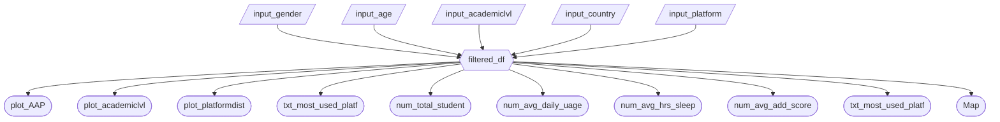

### 1 Updated Job Stories

| #   | Job Story                       | Status         | Notes                         |
| --- | ------------------------------- | -------------- | ----------------------------- |
| 1   | When I am a wellness coordinator, I want to filter and compare addiction scores across demographic groups so I can identify which student populations are most at risk and prioritize them for targeted intervention. | ⏳ Pending |                               |
| 2   | When I am a wellness coordinator, I want to visualize the relationship between addiction scores and key outcome variables. In a single view I want to look at sleep duration, mental health scores, and academic performance so I can build a comprehensive case for why digital well-being programs. |   ⏳ Pending  | |
| 3   | When I am a wellness coordinator, I want to compare average addiction scores across different social media platforms so I can determine whether certain platforms warrant platform-specific awareness messaging in my campaigns. | ⏳ Pending |                               |
| 4   | When I am a wellness coordinator, I want to identify countries whose student populations show addiction profiles similar to my university’s so I can research the intervention strategies their universities are using and adapt best practices for my own institution. | ⏳ Pending |

### 2 Component Inventory

| ID            | Type          | Shiny widget / renderer | Depends on                   | Job story  |
| ------------- | ------------- | ----------------------- | ---------------------------- | ---------- |
| `input_gender`| Input         | `ui.input_radio_buttons()`     | —                            |   1  |
| `input_age`   | Input         | `ui.input_slider()`     | —                            |  1  |
| `input_academiclvl`  | Input   | `ui.input_select()`     | —                            |  1   |
| `input_country`  | Input         | `ui.input_selectize()`     | —                            |  4   |
| `input_platform`  | Input         | `ui.input_selectize()`     | —                            |  3  |
| `filtered_df` | Reactive calc | `@reactive.calc`        | `input_gender`, `input_age`, `input_country`, `input_academiclvl`, `input_platform` | 1,2,3,4 | 
| `plot_AAP`  | Output        | `@render_altair`          | `filtered_df`                |    2     |
| `plot_academiclvl`  | Output        | `@render_altair`          | `filtered_df`                |     1    |
| `plot_platformdist`  | Output        | `@render_altair`          | `filtered_df`                |     3    |
| `plot_academiclvldist`  | Output        | `@render_altair`          | `filtered_df`                |    1     |
| `num_total_student`  | Output        | `@render_altair`          | `filtered_df`                |     1    |
| `num_avg_daily_uage`  | Output        | `@render_altair`          | `filtered_df`                |    2     |
| `num_avg_hrs_sleep`  | Output        | `@render_altair`          | `filtered_df`                |     2    |
| `num_avg_add_score`  | Output        | `@render_altair`          | `filtered_df`                |    1,2,3,4     |
| `txt_most_used_platf`  | Output        | `@render_altair`          | `filtered_df`                |    3     |
| `Map`  | Output        | `@render_widget`          | `filtered_df`                |    4     |

### 3 Reactivity Diagram
- `[/Input/]` (Parallelogram) (or `[Input]` Rectangle) = reactive input
- Hexagon `{{Name}}` = `@reactive.calc` expression
- Stadium `([Name])` (or Circle) = rendered output

Example:

Verify your diagram satisfies the reactivity requirements in Phase 3.2 before you start coding.

### 4 Calculation Details

For each `@reactive.calc` in your diagram, briefly describe:

`filered_df` depends on all five inputs (`input_gender`, `input_age`, `input_academiclvl`, `input_country`, `input_platform`). Then `@reactive.calc` dynamically filters rows based on the selected inputs the user provided with each input acts as an optional filter. For instance, `input_gender` and `input_academiclvl` inputs are provided, it filters rows based on the selected gender and academic level(s). All outputs consumes it and recompute in reponse to the changes in `filtered_df`.
